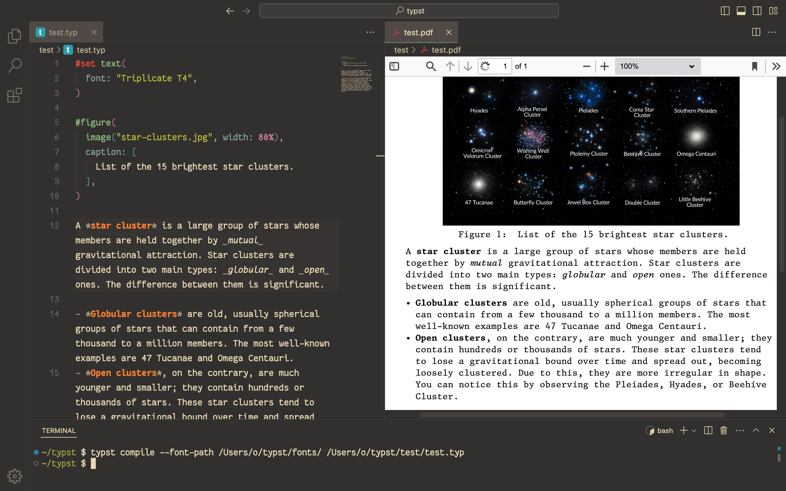

# typst setup

2024-10-09

The first typsetting system setup I had was writing LaTeX in [TeXShop](https://pages.uoregon.edu/koch/texshop/), an application created and released in the year 2000. I remember looking up packages through the [The Comprehensive TeX Archive Network](https://ctan.org/) (CTAN). And while I remember trying out [Overleaf](https://www.overleaf.com/), the online LaTeX editor, it never stuck.

<figure>
	
	<figcaption>TeXShop standalone setup</figcaption>
</figure>

This year, I have migrated over using the new and shiny Typst typesetting system, created in 2019 and released in 2023. I first used Typst in the browser but I prefer the simplicity of not having an account and using it through the Typst <abbr title="command line interface">CLI</abbr>. I installed Typst through MacPorts. My setup includes the Visual Studio Code text editor with two extensions: the [Typst Language Server Protocol](https://github.com/nvarner/typst-lsp) and [vscode-pdf](https://github.com/tomoki1207/vscode-pdfviewer).

<figure>
	
	<figcaption>Typst setup in the Visual Studio Code text editor</figcaption>
</figure>

As the screenshot illustrates, in order to use custom fonts, you have to add the custom font path when compiling:

```bash
typst compile --font-path path/to/fonts file.typ
```

It seems there is partial support for _hot reloading_. Although, if I want to see the custom fonts, I need to _recompile_ – I wonder if that's the case if I have the custom fonts installed on my system.