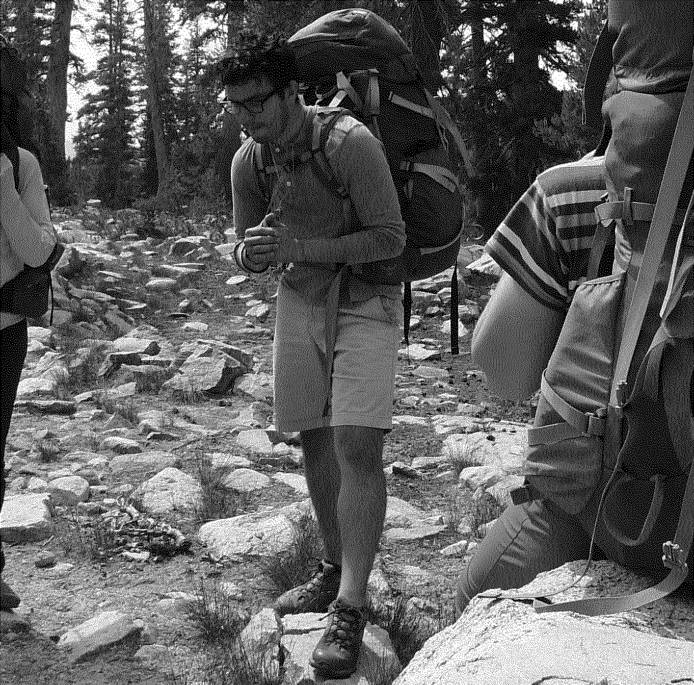

# about

<figure>
    
    <figcaption>Kings Canyon National Park (September 2019)</figcaption>
</figure>

<figure>
	<figcaption>Listen to my “Welcome!” message:</figcaption>
	<audio controls src="assets/welcome-to-my-website-message.mp3"></audio>
</figure>

Hey! My name is Bernardino. This is my personal (in other words, anything goes) website. Born in Jalisco, México, I was raised and reside in California. I find beauty in both logic and intuition, with a natural inclination towards the latter.

You may reach me by e-mail at ‘hi’ _at_ the domain.
