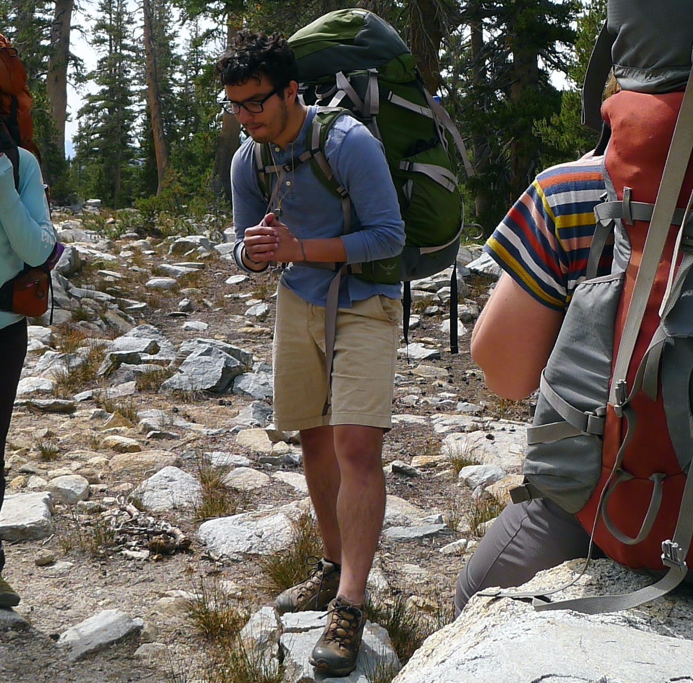

# who art thou?

<dl>
	<dt>email</dt>
        <dd><a href="mailto:webmaster@sunra.sh">webmaster@sunra.sh</a></dd>
    <dt>github</dt>
        <dd><a href="https://github.com/welpblah">github.com/welpblah</a></dd>
    <dt>mastodon</dt>
        <dd><a href="https://tldr.nettime.org/@b">tldr.nettime.org/@b</a></dd>
    </dl>

Hey there! My name is Bernardino. Born in México, I was raised and reside in California. I find beauty in both logic and intuition, with a natural leaning towards the latter. I’m infintely curious, after all: “wonder is simply the expression of ‘I’ within matter.”

This is my personal (in other words, anything goes) web site. Here you may find a small illustration of things I care for, e.g., the written word and the World Wide Web, to name a couple generalizations.

<figure>
    <figcaption>Listen to my “Welcome!” message:</figcaption>
    <audio controls src="assets/welcome-to-my-website-message.mp3"></audio>
</figure>